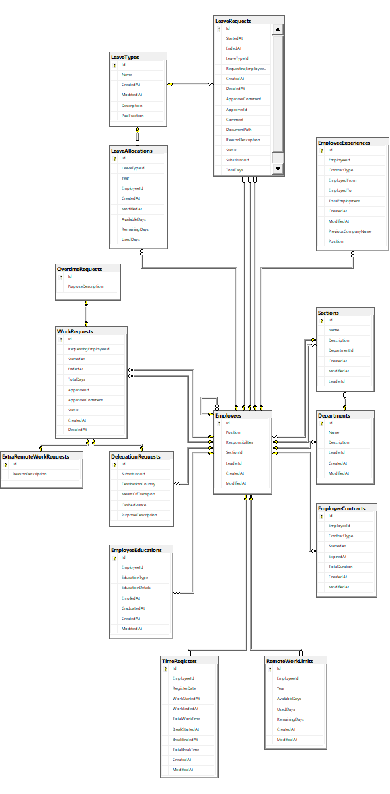
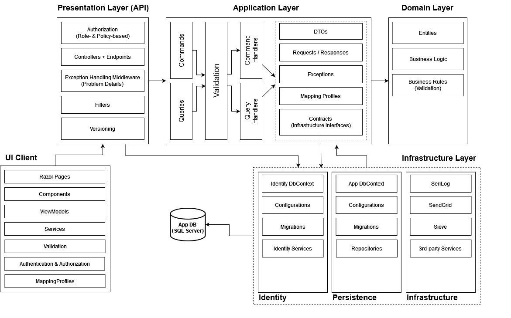

# HR Leave Management

HR Leave Management is an HRM-based system built as a precursor to a full-fledged ERP system for industry applies within small and medium-sized companies.

## Features

The following list describes the features developed for the current branch/version. Go to the [roadmap section](#roadmap) if you want to know what's coming in the next release

- Creating and modifying user accounts by administrator
- Creating and modifying employee accounts by HR department 
- Creating and modifying departments and department sections
- Allocating leave to employees as provided for in Polish law
- Creating and allocating new type of leaves to employees
- Multiple user roles [Admin, Manager, HR, Employee, CEO]
- Recording working time via a convenient calendar
- Requesting for leaves and employee absences
- Requesting for business trips and delegations
- Requesting for remote works
- Requesting for overtimes
- Communication with the team and superiors
- Notifications about upcoming events
- Confirmation of completed operations to employee e-mail
- Access to the tabular panel of the history of performed operations and events

## Tech Stack

**Server:** .NET 8.0/C#12, ASP.NET Core Web API, ASP.NET Core Identity + JWT Auth, Entity Framework Core, Background Services & Hangfire, SignalR, SendGrid, SeriLog, MediatR, Sieve, FluentValidation, AutoMapper, xUnit, Moq, FluentAssertions, Swagger

**Client:** .NET 8.0/C#12, Blazor WASM, NSwag, Razor Pages, MudBlazor, Heron.MudCalendar, FluentValidation, AutoMapper, xUnit, bUnit, Moq, FluentAssertions

**Database:** SQL Server
## Database

The following image describes the diagram for Domain

The following image describes the diagram for Identity

## Architecture

The solution follows a Clean Architecture layered approach:

- **Domain** – entities, business logic and business rules
- **Application** – CQRS, application logic, validation, DTOs, requests and responses 
- **API** – exposes endpoints, authorization rules
- **Infrastructure** – third-party and database 
    - **Persistence** - application database context and repositories
    - **Infrastructure** - third-party and its services
    - **Identity** - ASP.NET Identity database context and its services

## Roadmap

- Introduce DDD basics (Aggregates, Value Objects, Events) for Domain Entities
- Expand existing Domain business logic for checking advanced rules
- Introduce Event Driven Architecture essentials to expand existing CA architecture 
- Engage Redis for better performance
- Create a .NET MAUI Blazor Hybrid project and build mobile client using existing components
- Perform security tests

## Authors

- [@bartlomiej-potoniec](https://github.com/bartlomiej-potoniec)

